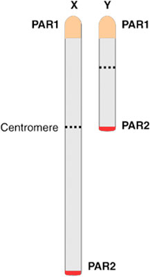

# Sample Quality

Samples could be errorous by platring error or sample mix-up. One of the effective way of handing this is check the sex of the samples. 

1. Gender itentity
2. Missing rate/Heterozygosity rate
3. identification of duplicated or related individuals
4. identification of individual divergent ancestry

## 1. Gender Identity

 Since males can have one X chromosome, the markers on the X chromosome couldn't be heterozygous except **Pseudoautosomal region of Y chromosome** [@Anderson2010]. To test Sex concordance, X chromosome heterozygosity/homozygosity rates are calculated by 
 
$$ Heterozygosity = \frac{N(NM)-N(HOM)}{N(NM)}$$
$$ Homozygosity = \frac{N(HOM)}{N(NM)}$$
Theoretically, male samples should have a homozygosity rate of 1 

X chromosome homozygosity rates to determine sex empirically [@Anderson2010].

 - 0.2 > F, Female, 0.8 < F, Male

## 2. Missing rate/Heterozygosity

- Low DNA quality / Low DNA concentration often have below average call rates and genotype accuracy.

- more than 3-7 % missing genotypes are removed.[@Cathy2010;@Anderson2010]

$$ Genotype call rate = \frac{number \; of \; Genotypes \; (Score \ge threshold)}{Number \; of \; Genotypes} $$

$$ missing rate = 1 - genotype \; call \; rate $$

- The Heterozygosity rate is calculated by $ (N-O)/N $ where N is the number of nonmissing genotypes and O is the number of homozygous call.

## 3. Sample Relatedness

in , and linked to the spurious association.

For easy calculation, just imagine that the value is decreased 1/2 by 1/2 when the degree of relationship increases.4

#### Sample Relatedness : PLINK vs KING

Plink calculates sample relatedness by following formula

$$ P(IBD=2) + \frac{1}{2} \times P(IBD=1) $$

- `PLINK --genome` output without LD Pruning

| FID1 | IID1 | FID2 | IID2 | RT | EZ | Z0 | Z1 | Z2 | PI_HAT | PHE | DST | PPC | RATIO |
|------|------|------|------|----|----|----|----|----|--------|-----|-----|-----|-------|
| LMS  | LMS  | KSH  | KSH  | UN | NA | 0.4491 | 0.0019 | 0.5489 | 0.5499 | -1 | 0.799262 | 0.6076 | 2.0173 |

- `PLINK --genome` output after LD pruning and removing High-LD region.

| FID1 | IID1 | FID2 | IID2 | RT | EZ | Z0 | Z1 | Z2 | PI_HAT | PHE | DST | PPC | RATIO |
|------|------|------|------|----|----|----|----|----|--------|-----|-----|-----|-------|
| LMS  | LMS  | KSH  | KSH  | UN | NA | 0.8719 | 0.0048  | 0.1234 | 0.1257 | -1 | 0.765165 | 0.6929  | 2.0359 |

- King output

| FID1 | IID1 | FID2 | IID2 | N_IBS0 | N_IBS1 | N_IBS2 | IBS | SE_IBS | N_HetHet | N_Het1 | N_Het2 | Distance | SE_Dist | Kinship |
|------|------|------|------|--------|--------|--------|-----|--------|----------|--------|--------|----------|---------|---------|
| LMS  | LMS  | KSH  | KSH  | 39602  | 246739 | 519451 |1.595| 0.582  |  79375   | 202248 | 203241 |   0.503  | 0.9164  | -0.0008 |

PI-HAT method 

KING's Method 

### Population Structure.

## Glossary

Pseudoautosomal region (PAR) 

