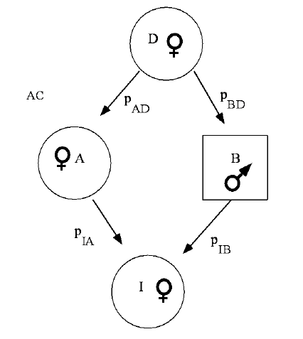
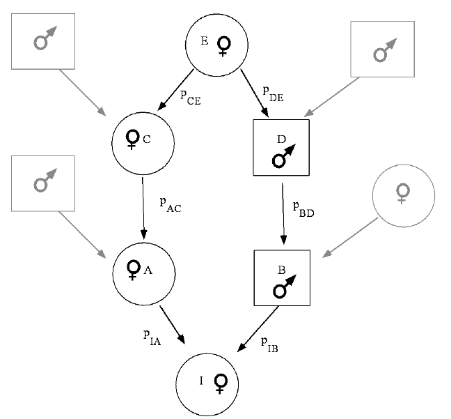
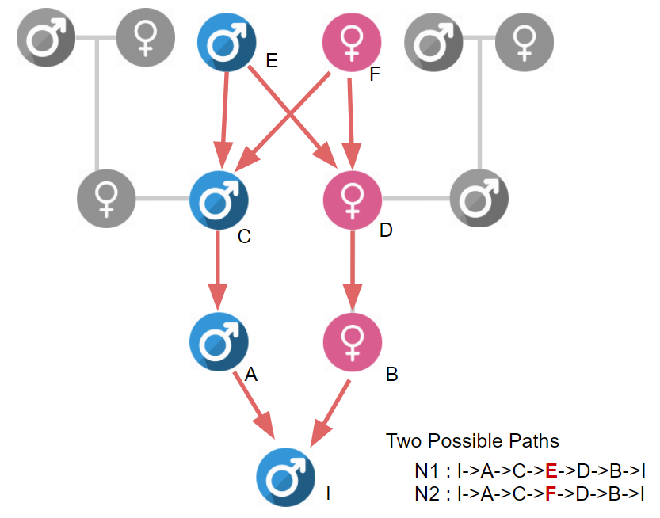
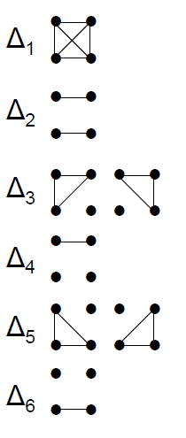
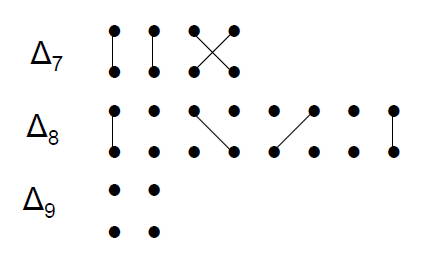
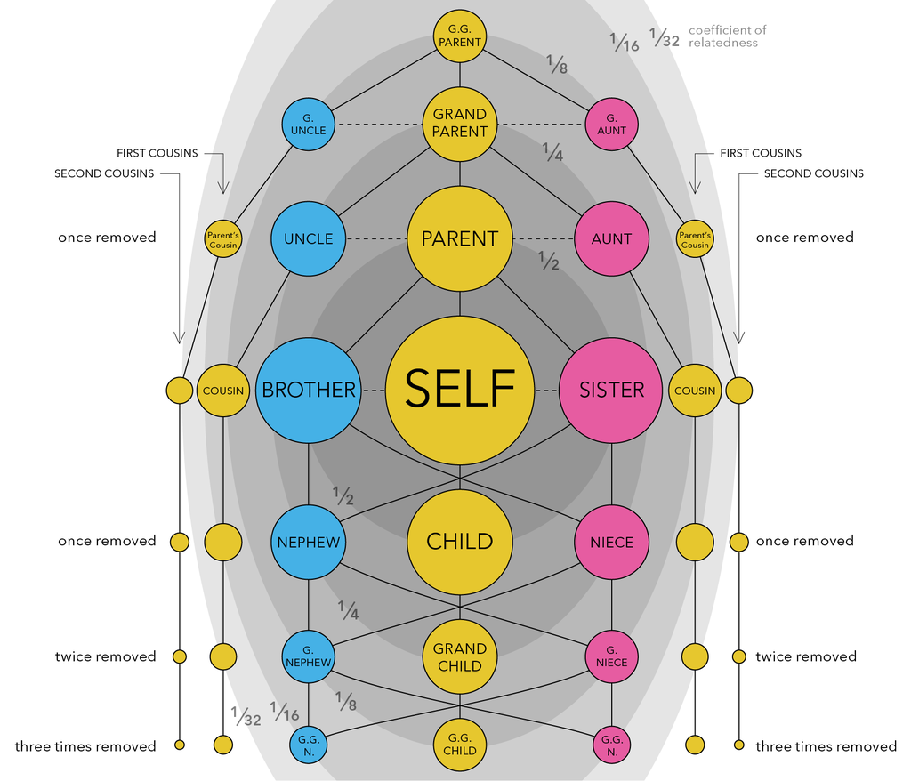

# Introduction

To understand the kinship and inbreeding coefficients, we need to understand the followings

# Some definitions

## IBS vs IBD

- **Identity by Descent (IBS)** - Two alleles are IBS if they are same. IBD is a subset of IBS
  
- **Identity by Descent (IBD)** - Two allele are IBD if one is **physical copy of the other**, or if they are **both physical copies of the same ancestral allele.**. so it means that the alleles were inherited from common ancester.

# kinship coefficient ($\phi$) and Inbreeding coefficient ($f_{i}$)

## Kinship Coefficient

- Kinship coefficient ($\phi$) - the probability that an allele selected randoly from two individuals are IBD

e.g) Some kinship coefficients

 
## Inbreedng coefficient ($f_{i}$)

 the measurement how inbred is an individual. generally,  the probability of one person's two allele are IBD (identical! and have same ancestry). and calculated by 
 
 $$ f_{i} = (\frac{1}{2})^{N} $$ 
 
 where f = the inbreeding coefficient, N = number of "nodes" in the path.
 
  
**Relationship between Kinship coefficient and inbreeding coefficient**
 

$$ \phi_{ii} = \frac{1}{2}(1+f_{i}) $$

where, $f_{i}=\phi_{kl}$, k and l is the parents of the i.

 
 e.g 1 ) Calculation inbreeding coefficient
 
 
 
 $$ f_{i} = (\frac{1}{2})^{3} = \frac{1}{8}$$
 
 e.g 2) **$F_{i}$ for Progeny of 1/2 cousins**
 
 $$ f_{i} = (\frac{1}{2})^{5} = \frac{1}{32}$$

e.g 3) **$F_{i}$ for Progeny of full cousins**
 
 

## Rules for calculating inbreeding coefficients

1. find all of the paths
2. for each path count the number of nodes (N)
3. the contribution to the inbreeding coefficient for each path = $(\frac{1}{2})^{N}$
4. The inbreeding coefficient is the sum of the contributions of the individual paths.

## Question : What is the inbreeding coefficient of an individual that is 

1. in an inbred population ?
2. the product of brother sister mating ?

# Identity states and Identity coefficients

the IBD status of a single locus for an individual can be represented by F and 1 - F, where F is the inbreeding coefficient

### Jacquar's 9 Cindensed Coefficients of Identity (1970)

IBD status 

- points are each allele column is maternal and parental and rows are each individuals.
- 

**Identity Coefficients**

**Relation between identity coefficients and kinship coefficient**

 $\phi_{ij} = \Delta_{1} + \frac{1}{2}(\Delta_{3} + \Delta_{5} + \Delta_{7}) + \frac{1}{4} \Delta_{8}$
 
 explanation
 
 -  $\Delta_{k} = 0$ for k=1,2,3,4 if i is not inbred
 -  $\Delta_{k} = 0$ for k=1,2,4,6 if k is not inbred
 -  $\Delta_{k} = 0$ except k=7,8,9 if neither of i and j is inbred.

**Table [Degree of Kinship]()** 

|Degree of  relationship | Relationship                        | Coefficient of  relationship (r) |
|-----------------------|-------------------------------------|---------------------------------|		
| 0         |	identical twins; clones             |	100%[4] (1)                     |
| 1         |	parent-offspring[5]	                | 50% ($2^{−1}$)                  |
| 2	        | full siblings	                      | 50% ($2^{−2}+2^{−2}$)           |
| 2	        | 3/4 siblings or sibling-cousins	    | 37.5% ($2^{−2}+2{−3}$)          |
| 2	        | grandparent-grandchild	            | 25% ($2^{−2}$)                  |
| 2	        | half siblings	                      | 25% ($2^{−2}$)                  |
| 3	        | aunt/uncle-nephew/niece	            | 25% ($2 \times 2^{−3}$)         |
| 4	        | double first cousins	              | 25% ($4 \times 2^{−4}$)         |
| 3	        | great grandparent-great grandchild	| 12.5% ($2{−3}$)                 |
| 4	        | first cousins	                      | 12.5% ($2 \times 2^{−4}$)       |
| 6	        | quadruple second cousins	          | 12.5% ($8 \times 2^{−6}$)       |
| 6	        | triple second cousins	              | 9.38% ($6 \times 2^{−6}$)       |
| 4	        | half-first cousins	                | 6.25% ($2^{−4}$)                |
| 5	        | first cousins once removed	        | 6.25% ($2 \times 2^{−5})$)      |
| 6	        | double second cousins	              | 6.25% ($4 \times 2^{−6}$)       |
| 6	        | second cousins	                    | 3.13% ($2 \times 2^{−6}$)       |
| 8	        | third cousins	                      | 0.78% ($2 \times 2^{−8}$)       |
| 10	      | fourth cousins	                    | 0.20% ($2 \times 2^{−10}$)      |

## Theory vs reality

the reality is not as simple as the theoretical calculation.
 
 - Selective Pressure and Linkage disequilibrium
 
 
Plink calculates sample relatedness by following formula

$$ P(IBD=2) + \frac{1}{2} \times P(IBD=1) $$

## SOme glossay

- 

## Wright's F-statistics or Coefficient relationship (r)

Genetic variation in subdivided population must be considered at three levels. 

-  Individual (I) in subpopulation: 
- (S) subpopulations; 
- (T) the total population as if there were no subdivision.

$F_{IT}$,$F_{IS}$,$F_{ST}$

an excess of homozygotes is a first clue that the population is inbreded.

Fis=(Hs=HI)/Hs

F = (Hexpected - Hobserved) / Hexpected

F=0 No inbreeding
F=1 completely Inbreeding

### Coefficient of relationship (r) - Sewall Wright@1922

- Sewall Wright made the solution.

    + $F_{IT}$ : The Inbreeding of an *I*ndividual relative to the *T*otal metapopulation = the probability of being IBD.  t

    + $F_{IS}$ : The inbreeding of an *I*ndividual relative to the *S*ubpopulation = the "pedigree" inbreeding

    + $F_{ST}$ : (Fixation index) the inbreeding of the *S*ubpopulation relative to the Total metapopulation = the "drift" inbreeding

### PI-HAT approximation

PI-HAT uses 

Z0 pr(IBD/IBS=0)
Z1 pr(IBD/IBS=1)
Z2 pr(IBD/IBS=1)

$$ PIHAT = P(IBD=2) + \frac{1}{2} \times P(IBD=1) $$