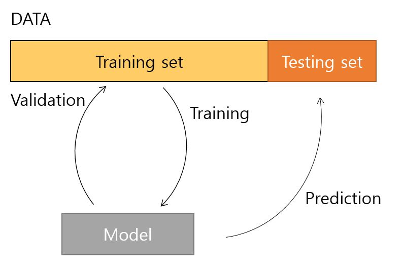
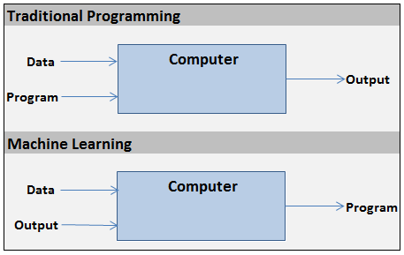

```{r setup, include=FALSE}
 #require(tufte)
 require(tidyverse)
 require(bookdown)
 require(HistData)
 require(readMLData)
 require(DiagrammR)
 require(ggplot2)

 options(width = 1200)

```

## EDGC ML study group

<div style="background-color:#FFFFFF;opacity:1; position:fixed; bottom:0px; right:10px left:10px top:10px; width:100%; height:140px;">
<hr widht="100%" style="border-top: dashed 1px;"/>

   &nbsp; <b>Byungju Kim </b> Ph.D. <br />
  &nbsp; Research Scientist / Bioinformatics Team <br />
  &nbsp; # 291 Harmony-ro, Yeonsu-gu, Incheon <br />
  &nbsp; mobile : +82-10-5091-8731 <br />
  &nbsp; email : byungju.kim@edgc.com 
  
</div>
<div class="container">

  

  <h5><span>
      Chapter 1 : &nbsp; The Machine Learning Landscape <br \>
      Author &nbsp; &nbsp; &nbsp; : &nbsp; Byungju Kim <br \>
      Date &nbsp; &nbsp; &nbsp; &nbsp; &nbsp; : &nbsp; 2018-10-01
  </span></h5>
  
 </div>

<!--
 Greetings, Everyone. this is first meeting of Machine Learning study group.
 I'm the guy who

-->

## What is the ML ?

**Machine Learning** is a Method for teaching computer (self-teaching) to make and improve predictions or behaviors based on the data. 

<span class="gray-bold"> - Some Quotes about Machine Learning</span>

<image src="./images/ArtSamuel.JPG" align=right style="margin-right: 10px;"> &nbsp; <blockquote> <span class="Big-first-letter">"</span> Give a computer the ability to learn without being explicitly programmed.<br \><br \>--- **Athur Samuel (1901-1990)** </blockquote> 


&nbsp; “How do we create computer programs that improve with experience?”  :

<image src="./images/TomWEF2017.JPG" align=right style="margin-right: 10px;"> 

<blockquote>  <span class="Big-first-letter">"</span>A computer program is said to learn from experience **E** with respect to some task **T** and some performance measure **P**, if its performance on **T**, as measured by **P**, improves with experience **E**.<br /><br .> --- **Tom Mitchell (1951-present)** </blockquote>

<!--


-->

## Some basic terms

**vector** 1-Dimensional array.

**Data** - our information for analysis.

- Quantitative, continuous data.
- Qualitative, categorical data.

  Generally, Data is matrix/Data frame.

$$ X = \left( \begin{array} {rrrr}
x_{11} & x_{12} & \cdots & x_{1p} \\
x_{21} & x_{22} & \cdots & x_{2p} \\
\vdots & \vdots & \ddots & \vdots \\
x_{n1} & \cdots & \cdots & x_{np} \\
\end{array} \right)
$$


* n : number of observation.

* p : number of variables that are available for use in making predictions.

* $x_{i,j}$ is element of an X matrix, representing the value of the jth variable for the
ith observation, where i = 1, 2,...,n and j = 1, 2,...,p.

**feature/descriptor/Predictor/independent variable (X)** is used to make a prediction for dependent variables. 

**Response/dependent variable (Y)** is that variable whose variation depends on other variables. normally expressed as Vector, $Y = \{y_{1}, y_{2}, y_{3} ... y_{n}\}$

**Training** is the way of teaching the computer the data.
                
**Training set**  is the data set used for training process.

**Testing/Validation** is the checking or proving the validity. (accuracy, error etc.)

**Testing set** is the subset of data which is used for the testing.
 
**Optimization** The process of adjusting weights to produce more and more accurate guesses about the data is known as parameter optimization.




## Traditional programming vs Machine learning.




## Example :: Spam-Filter - binary classification.


**DATA**                 : thousands of emails

**descriptor/predictor** : 

- Text Pattern : Free, 4U, crediit card, ... etc.

- Image Pattern : text/image ratio ... etc.

| no. email | Free  | Credit Card | Spam? |
| ---- | ----  | --- | --- |
| 1    | 6     | 1   | True  |
| 2    | 0     | 0   | False |
| 3    | 2     | 2   | False |
| ...  | ...   | ... | ... |
| 9999  | 4   | 6 | True |

### Traditional programming approach

Writing Rules by hand or human recognition.

e.g) spam = #Free >= 3 or $Credit card >=3


### ML approach

DATA determine the rules by training algorithm


Benefits for choosing ML.

- 

-

-

-

-


<!--
* vector : 1-Dimensional array. normally expressed as $K=\{a,b,c,d\}$

* n : number of observation.

* p : number of variables that are available for use in making predictions.
  e.g) year,age,sex, and more..
  
* $ x_{i,j} $ is element of an X matrix, representing the value of the jth variable for the
ith observation, where i = 1, 2,...,n and j = 1, 2,...,p.


### Statistical Inference and ML.

| ML | Statistical Inference |
DATA -> sampled data -> inference -> DATA


### Example :Spam Filter 


-->
<!--
## Type of the DATA ?

observation

data table

- Quantitative, continuous

- Qualitative, categorical or discrete

-->

## Type of Machine learning

- Supervised Learning (We already knows the answer) / Unsupervised learning (we do not knows the answer)
  
    * Classification and Regression are major two objectives of supervised learning.
  
      * **Classification** : output variable is categorical data (qualitative data) e.g) cancer vs non-cancer.
     
      * **Regression**     : output variable is a real value. e.g) Height, 
  
      * clustering is the main purpose of unsupervised learning.

<table>
<tr><td>Classification</td><td>Regression</td><td>Clustering</td>
</tr>
<tr><td></td>
<td></td>
<td></td>
</tr>
</table>
      


- Batch learning (Traditional Machine learning) / Online Learning

      * Batch learning use whole data at once for training. requires high computing resources.
      
      * Online learning learns data step by step and update the model.

- instance based learning (e.g. k-NN) / Model-based learning

     * No model is learned. stored "training instances" represent the "knowledge" (lazy learning) e.g) k-Nearleast neighbor.
     
     * make a model with various parameters.
     
**Model based learning**

### supervised Learning : `Label O`


* *k*-Nearleast Neighbor (*k*-NN)

* support vector machine
  
* Decision Tree/Random Forest

* linear regression
  
* Logistic regression
  
* Naive bayes

* Neural Network

### Unsupervised Learning : `label X`

  e.g) sales

**clustering**
  
* k-Mean
  
* Hierarchical Clustering
    
* Expectation Maximization
  
**Visualization and Dimensional reduction**
  
* PCA
    
* PCA^kernel^
    
* Locally-linear Embedding (LLE)
    
* t-SNE
  
**Association rule learning**

Rule-based machine learning which discovers the relationship between variables in large dataset.
    
* Apriori
    
* Eclat

### Semi-supervised learning : `label O + label X`


* Deep belief network (restricted Boltzmann machine)

* Reinforcement Learning

  - Reward / Penalty system for learning which maximize the rewards.


## Examples

<!--
### iris DATA

```{r}

str(iris)
iris[c(1:5,50:55,140:145),]

```

### GaltonFamily 

```{r}

str(GaltonFamilies)
GaltonFamilies[c(1:5,50:55,140:145),]

```
-->

### *k*-Nearleast Neighbor (*k*-NN)

in *k-NN classification*, the object is classified by a majority vote of its *k* neighbor.

Step 1: divide data into training and testing sets.

Step 2: calculate distance between objects in training set.

Step 3: Measure its performance (prediction accuracy, using parameter k = 1 ~ n-1 )

Step 4: determine *k*

Step 5: applying the instances and determined *k* to testing data.

---


Distance Calculation : *n* dimensions

 suppose that we have two vector P and Q consisting of n values.

 $$ d(P,Q) = \sqrt{\sum_{x=1}^{n}{(p_{1}-q_{1})^2 + (p_{2}-q_{2})^2 + (p_{3}-q_{3})^2 ... (p_{n}-q_{n})^2}} $$


```{r kNN}
   iris[1:4,1:5]
   iris_dist<-dist(iris[,1:4],upper=T,diag=T)     ## calculate euclidean distance
   iris_dist<-as.data.frame(as.matrix(iris_dist)) ## change dist object -> matrix -> data.frame
   iris_dist[1:5,1:5]
   #colnames(iris_dist)<-iris$Species
   first.instance<-t(iris_dist[60,])              ## select 60th row 
   first.instance<-as.data.frame(first.instance)
   first.instance$sample<-iris$Species
   
   colnames(first.instance)<-c("distance","sample")
   ggplot(first.instance,aes(sample,distance)) + geom_boxplot() + theme_bw()
   first.instance %>% arrange(distance) %>% head(11)
   
   
```   
### Dimensionality Reduction : Multidimensional scaling

```{r mds}
   
   mds_iris<-cmdscale(iris_dist,eig=T,k=2)
   
   iris_mds_df<-as.data.frame(mds_iris$`points`)
   iris_mds_df$species<-iris$Species
   head(iris_mds_df)
   
   ggplot(iris_mds_df,aes(V1,V2,colour=species))+geom_point() + theme_bw() + xlab("mds axis 1") + ylab("mds axis 2")

```


### linear regression

Linear regression make a linear model between response variable and independent variable.


$$ Y = \theta_{0} + \theta_{1}x_{1} + \theta_{2}x_{2} ... \theta_{n}x_{n}$$


```{r}

require(HistData)
str(GaltonFamilies)
head(GaltonFamilies)
df<-GaltonFamilies
attach(df)
G_LMODEL<-lm(childHeight ~ midparentHeight + as.numeric(df$gender))
summary(G_LMODEL)

pred<-G_LMODEL$coefficients[1] + G_LMODEL$coefficients[2]*df$midparentHeight + G_LMODEL$coefficients[3]*as.numeric(df$gender)

eq<-paste("Y==",format(G_LMODEL$coefficients[1],digits=2,nsmall=2),"+",format(G_LMODEL$coefficients[2],nsmall=2,digits=2),"%*% H[MidParent] +",format(G_LMODEL$coefficients[3],digits=2,nsmall=2),"%*% sex",sep=" ")
r.sq<-paste("adj-r^2 ==",summary(G_LMODEL)$adj.r.squared,sep=" ")

df<-data.frame(height=df$childHeight,predicted=pred)
p<-ggplot(df,aes(height,pred)) + geom_point() + geom_smooth(method="lm")+ theme_bw()
p<-p+ggtitle("Regression Analysis for Height of Galton Family study") + xlab("Predicted child's Height (inch)") + ylab("True Child's Height (inch)")
p<-p + annotate("text",x=-Inf,y=Inf,label=r.sq,parse=T,hjust=-0.05,vjust=1.05)
p<-p + annotate("text",x=Inf,y=-Inf,label=eq,parse=T,hjust=1.05,vjust=-0.5)
p

```

## Main Challenges of ML

## DATA

generally, quality and size of data are key for Machine Learning.

* Insufficient Quantity of Traning data.


* Non-representative Training data


Adding missing country changes the model (regression line).

By using a nonrepresentative training set, the Trained model is unlikely to make accurate predictions, especially for very poor and very rich countries.

Two type of non-representative training data.

- Sampling noise. 

    if sample size is too small, Signal could be generated by random chance.

- Sampling bias.  

    e.g) US presidential election in 1936 (Roosevelt vs Landon).
    
    Predicting genomic susceptibility using Korean Cancer vs American normal.
    
* Poor Quality data

    Noise, error in training data gained by poor-quality measurment will make harder for the systm to detect the underlying data patterns.
    Removal of outliers, 

* Irrelevent Features.

    Garbage in, Garbage out. Your system will only be capable of learning if the training data contains enough relevant features and not too many irrelevant ones. A critical part of the success of a Machine Learning project is coming up with a good set of features to train on
    
    - Feature selection - selecting the most useful features to train on among existing features.
    
    - Feature extraction - combining existing features to produce a more useful one.

    - creating new features by gathering new data.

### Algorithm


**Overfitting** 

* Model fits training data too well but not fits the testing data. it occcurs when the model captures the noise of the data.

* shows low bias but high variance

overcoming by

* Simplify the model by selecting one with fewer parameters
* Gather more data
* Remove the noise of the data

**Underfitting** 

* Model does not fit the data well.

* it occurs when the model cannot capture the underlying pattern of the data.

* shows low variacne but high bias

overcoming by

* choose more complex model by selecting more parameters.

* feeding better features to the learning algorithm.

* reduce the constraints on the model.

**Variance bias tradeoff**

$$ Pred_{err} = Bias^{2} + Variance + Irreducible Error$$


In ML, we are trying to reduce both of variance and Bias

Other Resources

<span class="gray-bold">Math</span>

* "Pure Math" : [Linear Algebra](https://ocw.mit.edu/courses/mathematics/18-06-linear-algebra-spring-2010/video-lectures/), Calculus^[1](https://ocw.mit.edu/courses/mathematics/18-01-single-variable-calculus-fall-2006/video-lectures/),[2](https://ocw.mit.edu/courses/mathematics/18-02sc-multivariable-calculus-fall-2010/index.htm)-section1,2^, [Gradient Descent](https://en.wikipedia.org/wiki/Gradient_descent)

* Probability and Statistics : [Open intro Statistics](https://www.openintro.org/stat/textbook.php)

* Programming (Python/R etc ...)

<span class="gray-bold">[Information theory](https://www.amazon.com/Elements-Information-Theory-Telecommunications-Processing/dp/0471241954/ref=pd_bxgy_b_img_c) </span>

<span class="gray-bold">Machine Learning</span>

* [Machine learning course@coursera](http://www.coursera.org/learn/machine-learning)

<span class="gray-bold">Deep Neural Network</span>

* [neural network course@coursera](http://www.coursera.org/learn/neuralnets)

* [deeplearinig.ai](https://www.deeplearning.ai/courses)

<span class="gray-bold">etc</span>

* About the document what I wrote : [Rmarkdown](https://bookdown.org/yihui/rmarkdown/) 

* Mathmatical equations : [LaTex](http://www.math.harvard.edu/texman/)

<!--
## Reference

* Hands on Machine Learning, Chapter 1.

* [Samuels checkers player]
  (https://webdocs.cs.ualberta.ca/~jonathan/publications/ai_publications/samuel.pdf)
  
* Statistical learning

* [Feature Selection](http://jmlr.csail.mit.edu/papers/volume3/guyon03a/guyon03a.pdf)
-->

