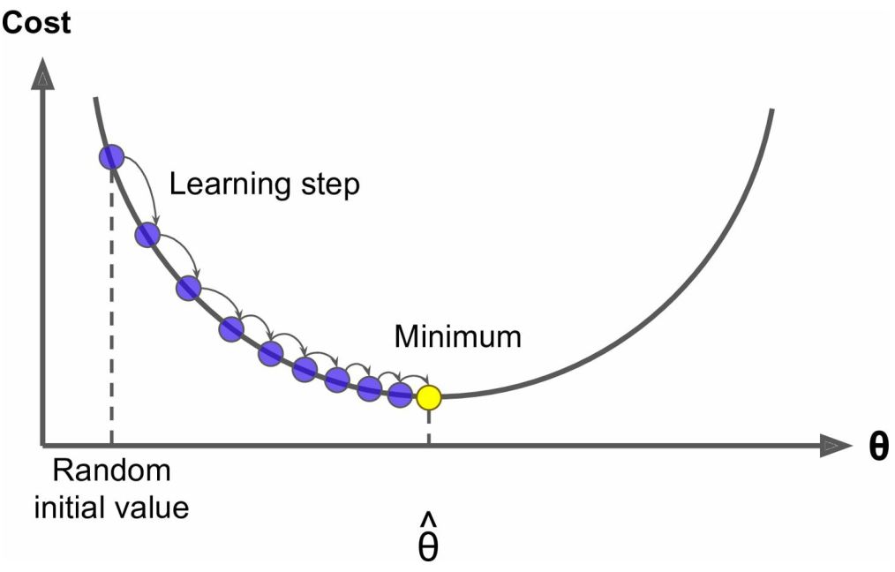

---
output:
  bookdown::html_document2: 
    css: css/style.css
    toc: yes
    highlight: espresso
    toc_depth: 4
    toc_float: yes
    code_folding: hide
    df_print: paged
---

```{r setup, include=FALSE}
knitr::opts_chunk$set(echo = TRUE)
require(tidyverse)
 require(bookdown)
 require(HistData)
 require(readMLData)
 require(DiagrammR)
 require(ggplot2)
 require(gridExtra)

```

<div style="background-color:#FFFFFF;opacity:1; position:fixed; bottom:0px; right:10px left:10px top:10px; width:100%; height:140px;">
<hr widht="100%" style="border-top: dashed 1px;"/>

   &nbsp; <b>Byungju Kim </b> Ph.D. <br />
  &nbsp; Research Scientist / Bioinformatics Team <br />
  &nbsp; # 291 Harmony-ro, Yeonsu-gu, Incheon <br />
  &nbsp; mobile : +82-10-5091-8731 <br />
  &nbsp; email : byungju.kim@edgc.com 
  
</div>
<div class="container">

  

  <h5><span>
      Chapter 4 : &nbsp; Modeling and its evaluation <br \>
      Author &nbsp; &nbsp; &nbsp; : &nbsp; Byungju Kim <br \>
      Date &nbsp; &nbsp; &nbsp; &nbsp; &nbsp; : &nbsp; 2018-11-21
  </span></h5>
  
 </div>


# Objectives of the chapter

* Learn how to fit the model. (how to select good model)

    * Least Square
    * Gradient Descent
    * Batch Gradient Descent
    * Stochastic Gradient Descent
    
* Understanding learning rate and curve. 
    
* Learn some regression models, such as

    * Linear Regression
    * Polynominal Regression
    * regularized regression, such as ridge, lasso and elastic net.
 
 
# How to fit t 


---

# Linear Regression

Simple linear regression (SLR) is an approach for predicting a quantitative response (dependent variables,ouput) using a single feature (single predictor or input variables). simple linear regression fits a straight line to the data.

```{r LinearRegression,fig.width=10,fig.height=4,fig.cap="**Relationship between dry weight and number of eggs female *Platorchestia platensis*,a kind of sand flea, carrying**. suppose that we are interesting in the relationship between female weight and the number of eggs."}

egg<-c(20,23,22,20,25,25,17,24,20,27,24,21,22,22,23,35,26,23,25,24,19,21,20,33,17,21,25,22)
weight<-c(5.38,7.36,6.13,4.75,8.10,8.62,6.30,7.44,7.26,7.17,7.78,6.23,5.42,7.87,5.25,7.37,8.01,4.92,7.03,6.45,5.06,6.72,7.00,9.39,6.49,6.34,6.16,5.74)

df <- data.frame(egg=egg,weight=weight,pred_egg=10.386+weight*1.892)

p1<-ggplot(df,aes(weight,egg)) # geom_smooth(method=lm,linetype="dotted") 
p1<-p1+ geom_point(shape=4,stroke=2,color="grey31") + theme_bw() +xlab("Dry Weight, mg") + ylab("Number of egg")
p1<-p1+ggtitle("A. egg vs dry weights")

p2<-ggplot(df,aes(weight,egg)) + geom_smooth(method=lm,linetype="dotted",se=FALSE,color="red") 
p2<-p2+ geom_point(shape=4,stroke=2,color="grey31") + theme_bw() +xlab("Dry Weight, mg") + ylab("Number of egg") 
p2<-p2+geom_point(data=df[c(1,16,24),],aes(weight,pred_egg),color="red",stroke=2,shape=4)
p2<-p2+annotate("segment",x=5.38,xend=5.38,y=20,yend=20.56496,color="dodgerblue3",size=2,alpha=0.5)
p2<-p2+annotate("segment",x=7.37,xend=7.37,y=24.33004,yend=35,color="dodgerblue3",size=2,alpha=0.5)
p2<-p2+annotate("segment",x=9.39,xend=9.39,y=33,yend=28.15188,color="dodgerblue3",size=2,alpha=0.5)
p2<-p2+ggtitle("B. application of Simple linear regression to McDonald's work (1980)")

grid.arrange(p1,p2,ncol=2)


```

We can grasp that the increment of Dry weight increases the number of eggs carrying. 

The distances, indicating a thick blue line,  between black x and red x is unpredicted proportion from the hypothesis.


$$
\begin{equation}
\begin{aligned}
Y &= H_{0}(x) + \epsilon \\ 
  &= \hat{Y} + \epsilon \\ 
  &= \theta_{0} + \theta_{1} x + \epsilon
\end{aligned}
(\#eq:SLR)
\end{equation}
$$

* Y : Acutual (ground truth) output.
* $\hat{Y}$ : predicted value, output.
* x : feature
* $\theta_{0}$ is the intercept
* $\theta_{1}$ is the coefficient for $x$ (slope of the line). if the predictor changes 1 point, the 
* $\epsilon$ is the error of the prediction .
* $\theta_{0} + \theta_{1} x$ : our hypothesis.

The equation is also written as follows :

$$ 
\begin{equation}
\hat{Y} = \Theta^{T} \cdot X
(\#eq:SLR2)
\end{equation}
$$ 

* feature vector, $X \ni\{x_{0} ... x_{n}\}$

* $\Theta^{T}$ is transposed {\theta_{0} ... \theta_{n}$

# Cost(Loss) function for Linear Regression

## **Mean Absolute Error** (=L1 Loss)

* Mean Absolute Error (MAE) is the sum of absolute differences between our prediction and ground truth. it measures average error in a set of prediction, by ignoring the direction of errors.

$$ MAE = \sum_{i=1}^{n} \frac{|\hat{y}_{i}-y_{i}|}{n}$$

## **Mean Squared Error** (=L2 Loss)

* Mean Square Error (MSE) is the sum of our prediction's squared error from the ground truth.

$$ MSE = \sum_{i=1}^{n} \frac{(\hat{y}_{i}-y_{i})^2}{n}$$

the equation is written in the matrix form.

$$ MSE= \frac{1}{n} \sum_{i=1}^{n} (\Theta^{T} \cdot x_{i} - y_{i} )^2 $$

**MSE is more sensitive for the outliers.**

e.g) dry weight vs eggs  

* Absolute Error vs Squared Error
```{r}
 df<-df %>% select(weight,egg,pred_egg) %>% mutate(AE=abs(egg-pred_egg),SE=AE^2) %>% arrange(weight) 
 df
```

* calculation
```{r}
 df %>% summarize(MAE=mean(AE)/2,MSE=mean(SE)/2,)
```


# how to choose it ?


<span class="redwine">**Sum of Squared Error (SSE)**</span>

* The model is better as lower the total error. this is sum of errors. so, model is estimated by <span class="redwine">least square criterion which minimize the sum of squared residuals/errors</span> written as :


$$
\begin{equation}
\begin{aligned}
 SSE &= \sum_{i=1}^{n} (y_{i}-\hat{y}_{i})^2 \; \; \; \; \; \; \; \text{in the case of one explanatory variable.}
\end{aligned}
(\#eq:SSE)
\end{equation}
$$

## Least Square for $\theta$ optimization

The least square finds the optimal parameter value by minimizing the SSE.

<!--
https://medium.com/@andrew.chamberlain/the-linear-algebra-view-of-least-squares-regression-f67044b7f39b
$$ 
\begin{equation}
\begin{aligned}
 SSE &= \sum_{i=1}^{n} (y_{i}-\hat{y}_{i})^2 \\
     &= \sum_{i=1}^{n} (y_{i}-\theta_{0}-\theta_{1}x_{i})^2 \\
     &= \sum_{i=1}^{n} ((y_{i} + \bar{y}_{i} - \bar{y}_{i} ) -\theta_{0}-\theta_{1} ( x_{i} + \bar{x}_{i} - \bar{x}_{i})^2 \\
     &= ... \\
     &= n(\bar{y}-\theta_{0} - \theta_{1} \bar{x})^2 + \sum_{i=1}^{n}(\theta_{1}x_{i} - \theta_{1} \bar{x} - y_{i}+ \bar{y} )^2 \\
     &= n(\bar{y}-\theta_{0} - \theta_{1} \bar{x})^2 + \sum_{i=1}^{n}(\theta_{1}(x_{i} - \bar{x}) - (y_{i} - \bar{y}) )^2 \\
     &= ... 
\end{aligned}
(\#eq:prrof_OLS_for)
\end{equation}
$$

-->

$$ \theta_{1} = \frac{\sum_{i=1}^{n} (X_{i} - \bar{X}) (Y_{i} - \bar{Y})} { \sum_{i=1}^{n} (X_{i}-\bar{X})^2}$$

$$ \theta_{0} = \bar{Y} - \theta_{1} \bar{x} $$

* Linear algebra form

$$
\begin{equation}
\begin{aligned}
 \hat{\theta} = (X^T \cdot X)^{-1} \cdot X^T \cdot y
\end{aligned}
(\#eq:LeastSquare)
\end{equation}
$$

* $\hat{\theta}$ is the $\theta$ value which minimize the cost function

## Gradient Descent

* adjust the parameter step by step to find minimum cost function.



## Learning rate/step and learning

<table>
<tr>
<td>

</td>
<td>

</td>
</table>

## batch graident descent

batch gradient descent method calculate the gradient of the cost function with regards for each given parameter $\theta_{j}$.
the gradient is calculated by applying derivative to the MSE formula.


\begin{equation}
\begin{aligned}
MSE(\theta) &= \frac{1}{n} \sum_{i=1}^{n} (\hat{y}_{i}-y_{i})^2 \\
\frac{d \cdot MSE(\theta)}{d \cdot \theta_{j}} &= \frac{2}{n} \sum_{i=1}^{n}(\theta^T \cdot x^{i} - y^{i})x_{j}^{i}
\end{aligned}
(\#eq:bGD)
\end{equation}

* Partial derivatives for whole $\theta$

$$ \nabla_{\theta} MSE(\theta) =\frac{2}{m} X^T \cdot (X \cdot \theta - y) $$

$$ \theta^{(\text{next step})} = \theta - \eta \nabla_{\theta} MSE(\theta) $$


## Stochastic Gradient Descent and grid search

Batch Gradient descent should use all training set to compute the gradient at every step. if we use large training set, then the calculation could be very slow. to evade these situation, stochastic gradient descent picks a random sample in the training set at every step and compute the gradients based only on the single instance


## Mini-batch gradient Descent

* calculate gradient using mini set of samples, named as mini-batch.

## Polynomial Regression

the real data are actually complex and has many variables. we can use <span class="redwind">power</span> to fit the `algebra formulat` to the data.

**example** dry weight vs egg

```{r}
        attach(df)
        pm.fit<-lm(egg ~ poly(weight,3))
        pm.fit10<-lm(egg ~ poly(weight,15))
 #       summary(pm.fit)
        
        lm.fit<-lm(egg ~ weight)
 #       summary(lm.fit)

 #       plot(df$weight,df$egg,xlab="dry weight",ylab="number of eggs")
 #       points(df$weight,fitted(lm.fit),col='red',pch=20)
 #       lines(sort(df$weight), fitted(lm.fit)[order(df$weight)], col='red', type='b') 
 #       points(df$weight,fitted(pm.fit),col='blue',pch=20)
 #       lines(sort(df$weight), fitted(pm.fit)[order(df$weight)], col='blue', type='b') 
 #       points(df$weight,fitted(pm.fit10),col='green',pch=20)
 #       lines(sort(df$weight), fitted(pm.fit10)[order(df$weight)], col='blue', type='b') 


```


## Learning Curves

* high-degee polynomial regression shows much better than with plain linear model. however, these high-degree complexity is severly overfitting the training data.

* Learning curve is one another approach to optimize parameters. it shows the relationship between `E` and `P`.


# Regression Shrinkage methods.

We are hoping to make a model which is also generalized in the unseen data. 

However, our model is always under the `Bias-variance tradeoff` rule. if the model underfits to the data (**underfitting**), then we can solve it by adding some more features and/or increaes the complexity. however, if the model has high variance and low bias (**overfitting**) then, we can solve it by reducing complexcity, increasing the sample size anding add some penalty.


**more on simple regression : analysis of the variance**

the total variance of `Y` has two components

* Regression sum of squares : regression sum of square. the error is gained by 

$$SSR = \sum_{i=1}^{n} (\hat{y}_{i}-\bar{y}_{i})^2$$

* Random error : error sum of squares

* Sum or squared residual (SSE)

$$SSE = \sum_{i=1}^{n} (y_{i}-\hat{y}_{i})^2$$

it measures overall errors.


* 

$$ SSTo = \sum (Y_{i}-\bar{Y})  (Y_{n}-\bar{Y}) $$

**Understanding the Errors, Variance and Bias**


$$ Error(x) = Bias^2 + Variance + \epsilon $$


L1 error

$$ MAE = \frac{1}{n} \sum_{i=1}^{n} (\hat{y}_{i}-y_{i})$$


$$ MSE = \frac{1}{n} \sum_{i=1}^{n} (\hat{y}_{i}-y_{i})^2$$


**Bias**

**Variance**


$$ Error = (\hat{Y}-Y)^2 + (\hat{Y} - \bar{Y}})^2 + \epsilon$$


The Shrinkage methods add penalty (regularization) to the **loss function** to control bias to get lower variance.


the `penalty term` 

--- 

## Bias-variance tradeff and L1/L2 regularization comparison


from https://courses.cs.washington.edu/courses/cse546/13au/code/oct8_recitation.html


let's assume that pair of data $(x_i, y_i) \in (\mathbb{R}, \mathbb{R})$ are generated from a model $y_i = f^\ast (x_i) + \epsilon_i $. Each $\epsilon_i$ is independently drawn from a Gaussian distribution with mean 0 and standard deviation $\sigma$.

For these examples, we will fix $\sigma = 0.1$ and $f^*(x) = 3 x^3 - x$, and we assume each $x_i$ is drawn from a uniform distribution between 0 and 1.


```{r}

sigma = 0.1

f_star <- function(x)
{
  return(3 * x**3 -x)
}

make_data <-function(x,seed=1234)
{
  x=rnorm(x)
  noise = sigma * x
  y= f_star(x) + noise
  return(matrix(c(x,y),ncol=2))
        
}

exampleData = make_data(10)

p<- ggplot(as.data.frame(exampleData),aes(x,y))+geom_point() + theme_bw()
p<- p +  stat_function(fun=f_star,geom="line")
p
#plot f_star
plot(exampleData)


```

----


## Understanding the penalty.

srinkage

**Motivations**

* Bias-Variance Trade off

* case of high bias, low variance (underfitting).
    * add features into the model and increases the complexity.

* case of high variance, low bias (over-fitting),
    * reduces the model complexity.
    * regularization.


<!--
| Least Sqares Regression (L2) | Reast Absolute Deviations Regression (L1) |
| :--- | :--- |
| Not very robust | robust |
| stable solution | unstable solution |
| always one solution | possibly multiple solution |
| no feature selection | built-in feature selection |
| non-spare output | sparse output |
| computational efficient due to having analytic solutions | computational inefficient on non-sparse casese |
-->

### Ridge regression (L2 regularization)

if $\theta_j$'s are freely determined.  

* They could be any number...

* showing high variance

Ridge regression regularized the coefficients to control variance by minimizing the coefficients (but not zero).

$$ J(\theta) = MSE(\theta) + \alpha \frac{1}{2} \sum_{i=1}^n \theta_{i}^2 $$
* $\alpha$ is a hyperparamter, meaning the amount of regularization. when $\alpha=0$, it is same as original regression (lineal or polynominal)

* the coefficients for intercept is not regularized since it stats from i=1.


* how to choose best $\theta$ ?.

$$ \hat{\theta} = (X^T \cdot X +aA)^{-1} \cdot X^T \cdot y $$

## Lasso regression ( L1 regularization)

<span class="redwine">Least Absolute Shrinkage and Selection Operator</span> performed **regularization** and **feature selection**. it puts a constraint on the Loss function (L1).

* generally used p > n since it has automatically does feature selection.


$$ J(\theta) = MAE(\theta) + \alpha \sum_{i=1}^n |\theta_{i}| $$


## $L_{1}$ and $L_{2}$ penalty


## Elastic Net. 

* Elastic Net uses the mixure of L_{1} and L_{2} penalty.

$$ J(\theta) = MSE(\theta) + r\alpha \sum_{i=1}^{n} |\theta_{i}| + \frac{1-r}{2}\alpha \sum_{i=1}{n} \theta_{i}^2 $$

## Early stopping


