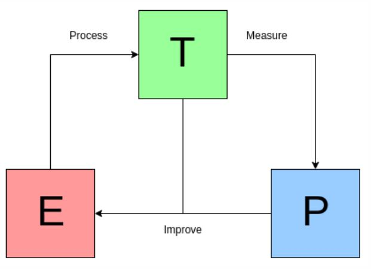

# What is the ML.

## Mitchell's paradigm

<blockquote>  <span class="Big-first-letter">"</span>A computer program is said to learn from experience **E** with respect to some task **T** and some performance measure **P**, if its performance on **T**, as measured by **P**, improves with experience **E**.<br /><br .> --- **Tom Mitchell (1951-present)** </blockquote>



## some glossary

**DATA** in the statistical point of views.

- quantitative
- qualitative

Generally, Data is matrix/Data frame.

$$ X = \left( \begin{array} {rrrr}
x_{11} & x_{12} & \cdots & x_{1p} \\
x_{21} & x_{22} & \cdots & x_{2p} \\
\vdots & \vdots & \ddots & \vdots \\
x_{n1} & \cdots & \cdots & x_{np} \\
\end{array} \right)
$$


## type of learning

* Supervised learning


* Unsupervised learning


## Regression 

We are hoping to make a model which is also generalised in the unseen data. 

However, our model is always under the `Bias-variance tradeoff` rule. If the model can not elucidate the data (**underfitting**), then we can solve it by adding some more features and/or increases the complexity. However, if the model has high variance and low bias (**overfitting**) then, we can solve it by reducing complexity, increasing the sample size anding add some penalty.


```{r paged.print=TRUE}

sigma = 0.5

f_star <- function(x)
{
  return(3 * x**3 -x)
}

make_data <-function(x,seed=20181122)
{
  set.seed(seed)
  x=rnorm(x,mean=0)
  noise = sigma * rnorm(x,mean=0,sd=15)
  y= f_star(x) + noise
  return(matrix(c(x,y),ncol=2))
        
}

exampleData = as.data.frame(make_data(100))
colnames(exampleData)<-c("X","Y")

t(exampleData[c(1:3,98:100),])

#plot f_star
p<- ggplot(exampleData,aes(X,Y))
p<- p + geom_point(size=4,fill="dodgerblue",shape=21,stroke=1,aes(color="data points"))
p<- p + stat_function(fun=f_star,geom="line",aes(color="f(x)"),size=1,linetype="dotted")
p<- p + ggtitle("True model to predict")
p<- p + scale_colour_manual(name=element_blank(),values=c("black","red"),breaks=c("data points","f(x)"),
                        guide=guide_legend(override.aes=list(
                                values=c("black","red"),
                                fill=c("dodgerblue",NA),
                                linetype=c("blank","dotted"),
                                shape=c(21,NA)
                        )))
p<-p+theme_bw() + theme(legend.background=element_rect(colour = "black"),legend.position=c(0,1),legend.justification =c(0,1))
p


```

## make model and find the optimal points.

```{r }

lm.fit<-lm(Y ~ X,data=exampleData)            ## linear regression
pm3.fit<-lm(Y ~ poly(X,3),data=exampleData)   ## polynominal regression : X^3
pm20.fit<-lm(Y ~ poly(X,20),data=exampleData) ## polynominal regression : X^15

exampleData$lm.fit<-lm.fit$fitted.values
exampleData$pm3.fit<-pm3.fit$fitted.values
exampleData$pm20.fit<-pm20.fit$fitted.values


p<- ggplot(exampleData,aes(X,Y))
p<- p + geom_point(size=3,fill="dodgerblue",shape=21,stroke=1,aes(color="data points"),alpha=0.2)
p<- p + stat_function(fun=f_star,geom="line",aes(color="f(x)"),size=1,linetype="dotted")

p<- p + geom_line(data=exampleData,aes(X,lm.fit,color="lm.fit"),linetype="solid",size=2.5,alpha=0.5)
p<- p + geom_line(data=exampleData,aes(X,pm3.fit,color="pm3.fit"),linetype="solid",size=2.5,alpha=0.5)
p<- p + geom_line(data=exampleData,aes(X,pm20.fit,color="pm20.fit"),linetype="solid",size=2.5,alpha=0.5)

p<- p + ggtitle("True model to predict")
p<- p + scale_colour_manual(name=element_blank(),values=c("black","red","#006400","orange","black"),
                        guide=guide_legend(override.aes=list(
                                values=c("black","red","green","orange","purple"),
                                fill=c("dodgerblue",NA,NA,NA,NA),
                                linetype=c("blank","dotted","solid","solid","solid"),
                                shape=c(21,NA,NA,NA,NA)
                        )))
p<-p+theme_bw() + theme(legend.background=element_rect(colour = "black"),legend.position=c(0,1),legend.justification =c(0,1))
p
```


## What is a good model ? 

the objectives of the model is predict the data as much as we want.

```{r}

summary(lm.fit)
summary(pm3.fit)
summary(pm20.fit)

testData = as.data.frame(make_data(100,seed=7777))
colnames(testData)<-c("X","Y")

testData$lm.pred<-predict(lm.fit,newdata = testData)
testData$pm3.pred<-predict(pm3.fit,newdata = testData)
testData$pm20.pred<-predict(pm20.fit,newdata = testData)

```

### Minimizing the Errors

Every measurement have errors. the error is calcluated by substration of predicted value ($\hat{y}_{i}$) from the real data value ($y_{i}$). So, <font class="redwine">The error at a given data point *i* </font> ($\epsilon_{i}$) is written as

$$ \epsilon_{i} = Y_{i} - \hat{Y}_{i} $$

* $y_{i}$ : real Y value for x_{i}
* $\hat{i}_{i}$ - model value (predicted) for x_{i}

if the model more learn from the data, the lesser errors it make

That is, we want to find an $\hat{f}$ that minimizes $R(\hat{f}) = \mathbb{E}_X[(\hat{f}(x) - y)^2] = \mathbb{E}_X[(\hat{f}(x) - f^*(x) - \epsilon)^2]$, where we're taking the expectation over the distribution of $X$.

there are two approaches to handle errors.


#### Mean absolute error

#### Mean squared error


it's absolute that if the model no error. it is the best model.


#### a little more advanced topic.

**Norm**

Norm is a linear algebra function which denotes Strict positive **length** or **size** to each vector in a vector space except for zero.

**L1 Norm**

**L2 Norm**


  
That is, we want to find an $\hat{f}$ that minimizes $R(\hat{f}) = \mathbb{E}_X[(\hat{f}(x) - y)^2] = \mathbb{E}_X[(\hat{f}(x) - f^*(x) - \epsilon)^2]$, where we're taking the expectation over the distribution of $X$.
Since $\epsilon$ is indenpendent from $x$, we can expand $R$ to obtain: $R(\hat{f}) = \mathbb{E}_X[(\hat{f}(x) - f^\ast(x))^2] + \sigma^2$. As a result of our noisy true model, we see that no matter what we choose for $\hat{f}$, we can never expect a loss less than $\sigma^2$.

In machine learning, we learn $\hat{f}$ from data, usually by minimizing the empirical risk on some training data. We assume our training dataset has been created for us by generating random i.i.d. samples $(x_i, y_i)$, and as a result, $\hat{f}$ itself is also random. Thus, the quantity we're actually interested in is $\mathbb{E}_D [\mathbb{E}_X [(\hat{f}(x) - f^*(x))^2]] + \sigma^2$, taking the expected value over a distribution on training data $D$ as well.
In class we saw that the first term can be decomposed into a bias and variance term. Letting $h(x) = \mathbb{E}_D[\hat{f}(x)]$, the function we expect to learn, we end up with
$\mathbb{E}_D [R(\hat{f})] = \mathbb{E}_D \mathbb{E}_X [[(f^*(x) - h(x))^2]] + \mathbb{E}_D \mathbb{E}_X [[(\hat{f}(x) - h(x))^2]] + \sigma^2$
This correspondes to a bias term, a variance term, and a noise term we cannot avoid.


### Test result

https://courses.cs.washington.edu/courses/cse546/13au/code/oct8_recitation.html

```{r}
p<- ggplot(testData,aes(X,abs(testData$Y-testData$lm.pred))) + geom_line(aes(color="lm"),size=1)
p<- p+geom_line(data=testData,aes(X,abs(testData$Y-testData$pm3.pred),color="pm3"),inherit.aes=T,size=1)
p<- p+geom_line(data=testData,aes(X,abs(testData$Y-testData$pm20.pred),color="pm20"),inherit.aes=T,size=1)
p<- p+scale_y_log10() + theme_bw() + ylab("log_10(Residuals)") + ggtitle("applying logarithm for y-axis scaling")
p

```


```{r}

## calculate MAE
sum(abs(testData$Y-testData$lm.pred))/100
sum(abs(testData$Y-testData$pm3.pred))/100
sum(abs(testData$Y-testData$pm20.pred))/100

## calculate MSE
sum((testData$Y-testData$lm.pred)**2)/100
sum((testData$Y-testData$pm3.pred)**2)/100
sum((testData$Y-testData$pm20.pred)**2)/100

```


---

# References 


----

```
# example

This is an [R Markdown](http://rmarkdown.rstudio.com) Notebook. When you execute code within the notebook, the results appear beneath the code. 

Try executing this chunk by clicking the *Run* button within the chunk or by placing your cursor inside it and pressing *Ctrl+Shift+Enter*. 

```{r}
plot(cars)
```

Add a new chunk by clicking the *Insert Chunk* button on the toolbar or by pressing *Ctrl+Alt+I*.

When you save the notebook, an HTML file containing the code and output will be saved alongside it (click the *Preview* button or press *Ctrl+Shift+K* to preview the HTML file).

The preview shows you a rendered HTML copy of the contents of the editor. Consequently, unlike *Knit*, *Preview* does not run any R code chunks. Instead, the output of the chunk when it was last run in the editor is displayed.
