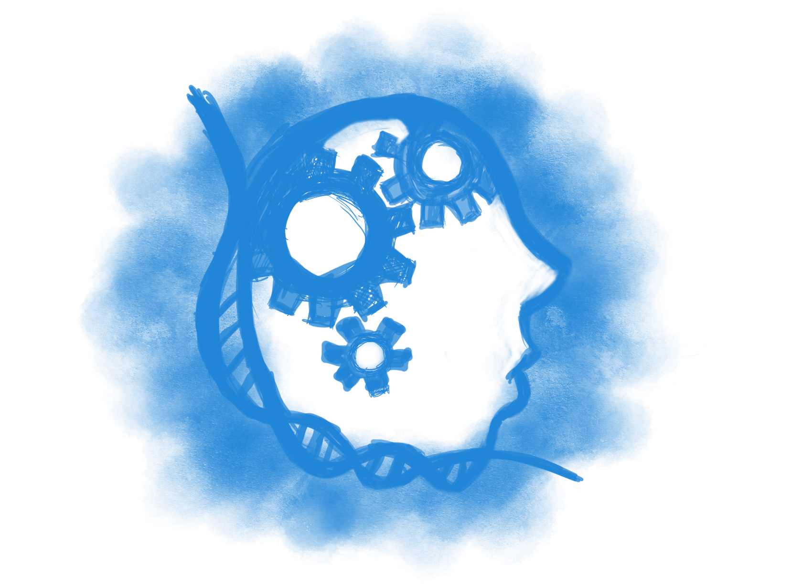

```{r setup, include=FALSE}
 #require(tufte)
 require(bookdown)
 require(HistData)
 require(readMLData)
 require(DiagrammR)
 require(ggplot2)

 options(width = 1200)

```

## EDGC ML study group

<div style="background:#FFFFFF; position:fixed; bottom:0px; right:10px left:10px top:10px; width:100%; height:140px;">
<hr widht="100%" style="border-top: dashed 1px;"/>

   &nbsp; <b>Byungju Kim </b> Ph.D. <br />
  &nbsp; Research Scientist / Bioinformatics Team <br />
  &nbsp; # 291 Harmony-ro, Yeonsu-gu, Incheon <br />
  &nbsp; mobile : +82-10-5091-8731 <br />
  &nbsp; email : byungju.kim@edgc.com 
  
</div>
<div class="container">
   
  <h5><span>
      Chapter 1 : &nbsp; The Machine Learning Landscape <br \>
      Author &nbsp; &nbsp; &nbsp; : &nbsp; Byungju Kim <br \>
      Date &nbsp; &nbsp; &nbsp; &nbsp; &nbsp; : &nbsp; 2018-10-01
  </span></h5>
 </div>

<!--
 Greetings, Everyone. this is first meeting of Machine Learning study group.
 I'm the guy who

-->

## Before Start 

<span class="gray-bold">-- some useful sources</span>

* "Pure Math" : [Linear Algebra](https://ocw.mit.edu/courses/mathematics/18-06-linear-algebra-spring-2010/video-lectures/), Calculus^[1](https://ocw.mit.edu/courses/mathematics/18-01-single-variable-calculus-fall-2006/video-lectures/),[2](https://ocw.mit.edu/courses/mathematics/18-02sc-multivariable-calculus-fall-2010/index.htm)-section1,2^, [Gradient Descent](https://en.wikipedia.org/wiki/Gradient_descent)
          
* Probability and Statistics : [Open intro Statistics](https://www.openintro.org/stat/textbook.php)

* Programming (Python/R etc ...)

* Information theory :

## Some basics and terms

* vector : 1-Dimensional array. normally expressed as $K=\{a,b,c,d\}$

* n

*


## What is the ML ?

<span class="gray-bold">- Quotes about Machine Learning</span>

<image src="./images/ArtSamuel.JPG" align=right style="margin-right: 10px;"> &nbsp; <blockquote> <span class="Big-first-letter">"</span> Give a computer the ability to learn without being explicitly programmed.<br \><br \>--- **Athur Samuel (1901-1990)** </blockquote> 


&nbsp; well proposed learning problem :

<image src="./images/TomWEF2017.JPG" align=right style="margin-right: 10px;"> 

<blockquote>  <span class="Big-first-letter">"</span>A computer program is said to learn from experience **E** with respect to some task **T** and some performance measure **P**, if its performance on **T**, as measured by **P**, improves with experience **E**.<br /><br .> --- **Tom Mitchell (1951-present)** </blockquote>

<!--


-->

### The Concept

Method for teaching computer to make and improve predictions or behaviors based on the data.


                               new data              
 
input data -> Machine (Learn) --> Model (parameter Optimization) --> 

### Statistical Inference

DATA -> sampled data -> inference -> DATA


### Example :Spam Filter 


## Type of the DATA ?

observation

data table

- Quantitative, continuous

- Qualitative, categorical or discrete

## Type of Machine learning

### supervised Learning : `Label O`

>

We already knows "Right answer" of the 

Two objectives  of Supervised learning are *classification*


* *k*-Nearleast Neighbor (*k*-NN)

* support vector machine
  
* Decision Tree/Random Forest

* linear regression
  
* Logistic regression
  
* Naive bayes

* Neural Network

### Unsupervised Learning : `label X`

  e.g) sales

**clustering**
  
* k-Mean
  
* Hierarchical Clustering
    
* Expectation Maximization
  
**Visualization and Dimensional reduction**
  
* PCA
    
* PCA^kernel^
    
* Locally-linear Embedding (LLE)
    
* t-SNE
  
**Association rule learning**
    
* Apriori
    
* Eclat

### Semi-supervised learning : `label O + label X`

* Deep belief network
    
* restricted Boltzmann machine
    
* Reinforcement Learning

## Examples

### iris DATA

```{r}
str(iris)
```

### GaltonFamily 

```{r}
str(GaltonFamilies)
```

### B Breast Cancer

```{r}

```


### *k*-Nearleast Neighbor (*k*-NN)

* Most simplest alogrithm which find k samples ~~ majority of vote.


 $$ Dist_{(p,q)} = \sqrt{\sum_{x=1}^{n}{(p_{x}-q_{x})^2}} $$

* *n* dimensions

 $$ Dist_{(p,q)} = \sqrt{\sum_{x=1}^{n}{(p_{1}-q_{1})^2 + (p_{2}-q_{2})^2 + (p_{3}-q_{3})^2 ... (p_{n}-q_{n})^2}} $$


```{r kNN}

   iris_dist<-dist(iris[,1:3],upper=T,diag=T)     ## calculate euclidean distance
   iris_dist<-as.data.frame(as.matrix(iris_dist)) ## change dist object -> matrix -> data.frame
   
   iris_dist[1:5,1:5]
   
   mds_iris<-cmdscale(iris_dist,eig=T,k=2)
   
   iris_mds_df<-as.data.frame(mds_iris$`points`)
   iris_mds_df$species<-iris$Species
   head(iris_mds_df)
   
   ggplot(iris_mds_df,aes(V1,V2,colour=species))+geom_point() + theme_bw() + xlab("mds axe 1") + ylab("mds axe 2")
   
   
   
```   


```


### Regression

**Comparison between Linear Regression and Logistic Regression**

| Regression | Linear | Logistic |
| --- | --- | --- | 
| Input  | real-valued output | T/F or discrete variables |
| Output |      |       |
| equation |    |       |

* Linear              : 

* Logistic Regression : True/False

#### linear regression
  
#### Logistic regression
  
* support vector machine
  
* Decision Tree/Random Forest
  
* Neural Network

## Challenges

* classification

* ~~~

*


## Glossary

- Input data

- Output

## Other Resources

<span class="gray-bold">Information theory </span>

<span class="gray-bold">Machine Learning</span>

* [Machine learning course@coursera](http://www.coursera.org/learn/machine-learning)

<span class="gray-bold">Deep Neural Network</span>

* [neural network course@coursera](http://www.coursera.org/learn/neuralnets)

* [deeplearinig.ai](https://www.deeplearning.ai/courses)

<span class="gray-bold">etc</span>

* About the document what I wrote : [Rmarkdown](https://bookdown.org/yihui/rmarkdown/) 

* Mathmatical equations : [LaTex](http://www.math.harvard.edu/texman/)

## Reference

* Hands on Machine Learning, Chapter 1.

* Samuels checkers player
  (https://webdocs.cs.ualberta.ca/~jonathan/publications/ai_publications/samuel.pdf)
  
* Statistical learning


