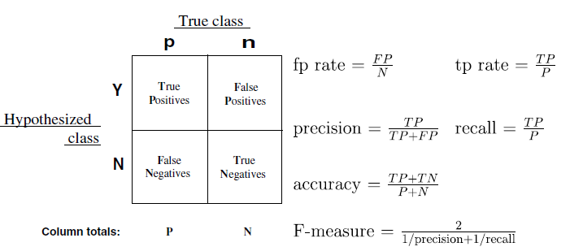

## ROC curve 

## Introduction

**Receiver operating characteristics** (ROC) analysis is a tool for visualizing, organizing and selecting classifiers based on their performance. the curve is adapted to medical area and widely used.


## Understanding the classifier performance

**Binary Classification**

Let's think we have a BNinary classification problem with various instances labeled by p and n.

$$ I\{p,n\} \rightarrow \{Y,N\} $$

there are 4 possible outcomes from the classifier as shown in Fig 1.



- **True Positive (TP)** - instance is Positive (*p*) and it is classified as positive (**Y**)

- **True Negative (TN)** - instance is Negative (*n*) and it is classified as negative (**N**)

- **False Positive (FP)** - instance is Negative (*n*) and it is classified as positive (**Y**)

- **False Negative (FN)** - instance is Positive (*P*) and it is classified as negative (**N**)

- **True Positive Rate (TPR)** $TPR = \frac{TP}{TP+FN}$. also called as recall or sensitivity.

- **False Positive Rate (FPR)** $FPR = \frac{FP}{FP+TN}$. also called as recall or 1-specificity


The Diagonal represents the **correct(TRUE) decision**.


## Understanding ROC Space

ROC graphs are 2-D graphs in which TP rate is plotted on the "Y" axis and FP rate is plotted on the X axis".

A **discrete classifier** is one that outputs only a class label. Each discrete classifier produces an (fp rate, tp rate) pair
corresponding to a single point in ROC space. The classifiers in Fig. 2 are all discrete classifiers.


```{r}
require(ggplot2)

p<-ggplot(data.frame(x=c(0,0.1,0.4,0.6,0.6),y=c(1,0.6,0.8,0.7,0.2),txt=c("A","B","C","D","E")),aes(x,y,label=txt))+geom_text() + theme_bw() + geom_abline(slope = 1,color="red",linetype=2) + xlim(c(0,1)) + ylim(c(0,1)) + xlab("FPR") + ylab("TPR")

## p<-p+annotate(geom="text",label="better classifier",aes(x=0.4,y=0.4))
p

```

**FIg 2** A basic ROC graph showing 5 discrete classifiers

- Northern Western points are better classifier(high TP rate and low FP rate). (0,1) point (A) is the perfect classifier.

- bottom right  direction point - bad

- bottom left direction point (0,0)

**Random performance** Random performance (Red dotted line) indicates that the classifier randomly guessing a class. any points (E) located on lower triangle area is worse than random guessing.

## Curves in the space

Discrete classifiers such a Decision tree

Some classifiers such as a Naive Bayes classifier or a neural network, naturally yield an instance **probabiluty** or **score** and the numeic value represents the degree to which an instance is a member of a class.


### Case Study : ROC curve for SVM classifier

for example, let's think of the SVM classifier to predict species by sepal length, sepal width, petal length and petal width


```{r}
        require(e1071)


        data<-iris
        set.seed(12345)
        data$set<-"test"
        train<-sort(sample(1:150,50))
        data[train,]$set<-"train"
 
 
        svm_model<-svm(data[data$set=="train",c(1,2,3,4)],data[data$set=="train",]$Species,probability=TRUE)
        pred<-predict(svm_model,data[data$set=="test",c(1,2,3,4)],probability=TRUE,decision.value=TRUE)

 
```

* here is the contingency table.
        
```{r}
        table(pred,data[data$set=="test",]$Species)
```

* Support Vector Machine (SVM) outputs scores by default. the threadhold is simply set on the decision function.
 
```{r}
        head(attr(pred,"probabilities"))
        head(attr(pred,"decision.values"))
```

use rOCR package to make blah blah blah

```{r}
        require(ROCR)
        prob.versicolor <- attr (pred, "probabilities")[, "versicolor"]
        prob.setosa <- attr(pred,"probabilities")[,"setosa"]
        prob.virginica <- attr(pred,"probabilities")[,"virginica"]
        
        roc.versicolor.pred <- prediction (prob.versicolor, data[data$set=="test",]$Species == "versicolor")
        roc.setosa.pred <- prediction (prob.setosa, data[data$set=="test",]$Species == "setosa")
        roc.virginica.pred <- prediction (prob.virginica, data[data$set=="test",]$Species == "virginica")
        
        perf.versicolor<-performance(roc.versicolor.pred,"tpr","fpr")
        perf.versicolor.auc<-performance(roc.versicolor.pred,"auc")
        perf.setosa<-performance(roc.setosa.pred,"tpr","fpr")
        perf.setosa.auc<-performance(roc.setosa.pred,"auc")
        perf.virginica<-performance(roc.virginica.pred,"tpr","fpr")
        perf.virginica.auc<-performance(roc.virginica.pred,"auc")
        
        roc.df<-data.frame (fpr = c(perf.versicolor@x.values [[1]],perf.setosa@x.values[[1]],perf.virginica@x.values[[1]]), tpr = c(perf.versicolor@y.values [[1]],perf.setosa@y.values[[1]],perf.virginica@y.values[[1]]), 
                threshold = c(perf.versicolor@alpha.values [[1]],perf.setosa@alpha.values[[1]],perf.virginica@alpha.values[[1]]), 
                cost = 1, gamma = 1,class=c(rep("versicolor",length(perf.versicolor@x.values [[1]])),rep("setosa",length(perf.setosa@x.values [[1]])),rep("virginica",length(perf.virginica@x.values [[1]]))))
       
        p<-ggplot(roc.df,aes(x=fpr,y=tpr,color=class))+geom_line(size=2) +  geom_abline(slope = 1,color="red",linetype=2) +theme_bw()
        p <- p + scale_color_manual(name="",
                               breaks=c("setosa","versicolor","virginica"),
                               labels=c(
                                       paste0("setosa ",sprintf("(auc : %.2f)",perf.setosa.auc@y.values[[1]])),
                                       paste0("versicolor ",sprintf("(auc : %.2f)",perf.versicolor.auc@y.values[[1]])),
                                       paste0("virginica ",sprintf("(auc : %.2f)",perf.virginica.auc@y.values[[1]]))),
                               values=c("#999999","#E69F00","#5684E9"))
        p <- p + theme(legend.position=c(0.8,0.2))
        p + coord_cartesian(xlim=c(-0.01,1.01),ylim=c(-0.01,1.01),expand = FALSE)


```


## HOWTO analyis


## svm with e1071 and ROC curve


##


## References

An introduction to ROC analysis

ROC Analysis of Classifiers in Machine Learning
